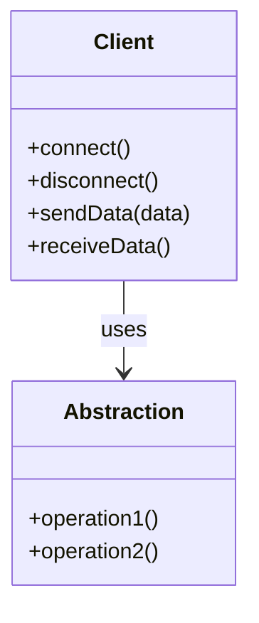

# Process Manager clients and abstractions

```mermaid
classDiagram
    class Client {
        +connect()
        +disconnect()
        +sendData(data)
        +receiveData()
    }

    class Abstraction {
        +operation1()
        +operation2()
    }

    Client --> Abstraction : uses
```
