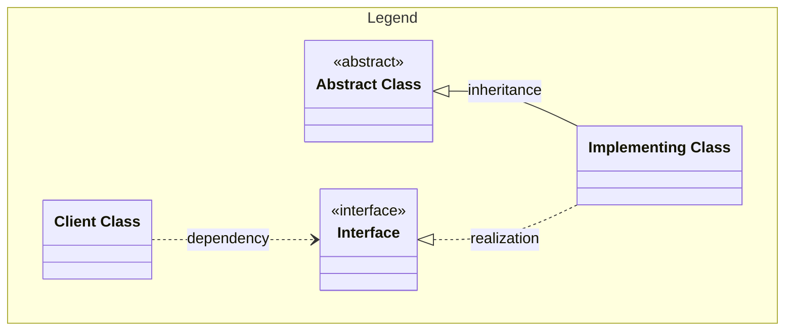
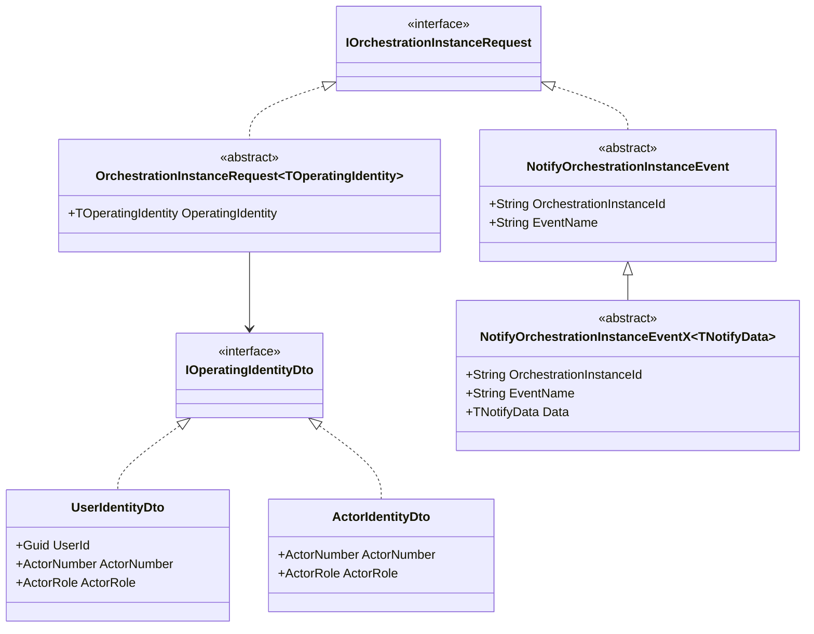

# Process Manager clients and abstractions

## Purpose

In this markdown file we will make a proof-of-concept for the use of Mermaid diagrams in MD files.

We want to investigate if it feels easier to maintain Mermaid diagrams, than our current Miro board. Also it could be beneficial to have the code and the diagrams closer to each other, and be able to mix text and diagrams in a more elegant way that at least Miro handles it.

GitHub supports [Mermaid diagrams in markdown files](https://github.blog/developer-skills/github/include-diagrams-markdown-files-mermaid/), so we expect it is easy to browse our MD files and read documentation and diagrams on GitHub.

For VS Code you can install [bierner.markdown-mermaid extension](https://marketplace.visualstudio.com/items?itemName=bierner.markdown-mermaid) to be able to preview the diagrams locally.

## Class Diagram for abstractions hierarchy

### Legend

Mermaid syntax for [class diagrams](https://mermaid.js.org/syntax/classDiagram.html).

### Diagram

